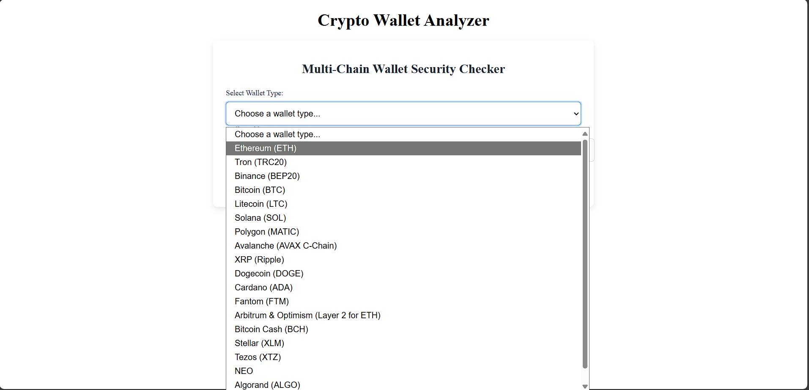
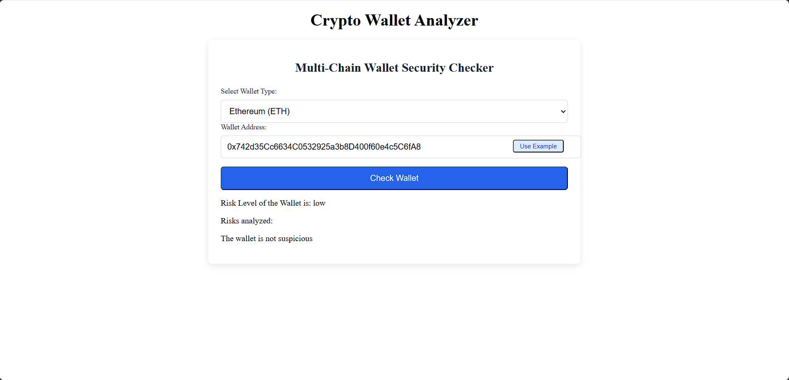

# 🚀 Crypto Wallet Analyzer

Crypto Wallet Analyzer is an **API-first application** to inspect and analyze crypto wallets.  
It consists of a **backend server** (that exposes APIs for wallet analysis) and a **frontend UI**, allowing users to run analyses on wallet data and view results in a user-friendly web interface.  

---

## 📌 Table of Contents
- [Overview](#overview)
- [Usage](#Usage)
- [How It Works](#how-it-works)
- [Features](#features)
- [Architecture](#architecture)
- [Tech Stack](#tech-stack)
- [Getting Started](#getting-started)
- [Configuration](#configuration)
- [Usage](#usage)
- [Project Structure](#project-structure)


---

## 📖 Overview
Crypto Wallet Analyzer allows users to **inspect wallet activity** and view meaningful analytics through a clean web interface.  
It is designed with modularity in mind: the **backend handles APIs & processing**, while the **frontend renders interactive dashboards**.

---

## 🚀 Usage
### Using from Frontend
1. Open the frontend in your browser.  
2. Enter a wallet address to analyze.  

#### 📸 Screenshots
- **Home Page**  
  

- **Analysis Results**  
  

### Using API

The backend exposes several REST API endpoints for wallet validation, transaction fetching, and risk analysis.  
All endpoints return JSON responses.

### 1️⃣ Health Check
**Endpoint:**  
```bash
  GET /api/health
```
**Description:**  
Checks if the backend server is running.  

**Response:**
```json
{
  "status": "ok",
  "message": "Crypto Wallet Analyzer backend is running"
}
```

### 2️⃣ Check Wallet Risk
**Endpoint:** 
```bash
POST /api/check-wallet
```
**Request Body:**
```json
{
  "walletAddress": "0x123abc456def...",
  "walletType": "ethereum"
}
```

**Response Example:**
```json
{
  "wallet": "0x123abc456def...",
  "type": "ethereum",
  "valid": true,
  "blacklisted": false,
  "riskScore": 42,
  "analysis": {
    "suspiciousTransactions": 3,
    "totalTransactions": 152,
    "lastActivity": "2025-09-12T10:45:00Z"
  }
}

```

### 3️⃣ Transaction History

**Endpoint:**
```bash
GET /api/transactions/:walletAddress
```

Description:
Fetches the transaction history of a given wallet address.

Response Example:
```json
{
  "wallet": "0x123abc456def...",
  "transactions": [
    {
      "hash": "0xabcd...",
      "from": "0x111...",
      "to": "0x222...",
      "value": "1.2 ETH",
      "timestamp": "2025-09-10T12:30:00Z"
    },
    {
      "hash": "0xefgh...",
      "from": "0x333...",
      "to": "0x444...",
      "value": "0.5 ETH",
      "timestamp": "2025-09-11T09:15:00Z"
    }
  ]
}
```

4️⃣ Wallet Summary

**Endpoint:**

```bash
GET /api/summary/:walletAddress
```

Description:
Returns a summary of wallet statistics (balance, total transactions, average transaction size, etc.).

Response Example:
```json
{
  "wallet": "0x123abc456def...",
  "balance": "3.7 ETH",
  "totalTransactions": 152,
  "firstSeen": "2021-08-10",
  "lastActivity": "2025-09-12"
}
```

---

## 🔎 How It Works
1. **User enters a wallet address** in the frontend UI.  
2. **Frontend sends the request** to the backend API.  
3. **Backend validates the wallet address** and checks against known blacklists.  
4. **Transaction history is fetched** from external APIs (e.g., blockchain explorers).  
5. **Risk analysis is performed** on the wallet:
   - Suspicious activity detection  
   - Frequency of transactions  
   - Interaction with flagged addresses  
   - Balance and activity trends  
6. **Results are returned to the frontend** in JSON format.  
7. **Frontend displays analysis** in a clean dashboard with charts and summaries.  

📊 *In short: Address → Validation → Data Fetch → Risk Analysis → Visualization.*  

---

## ✨ Features
- 🔍 Analyze cryptocurrency wallet addresses  
- 📊 View wallet details, transactions, and activity trends  
- 🌐 Full-stack architecture (backend + frontend)  
- ⚡ Quick local setup with `npm`  
- 📱 User-friendly UI  

---

## 🏗 Architecture

Crypto-Wallet-Analyzer/

├── backend/ # API & server logic

└── frontend/ # Client UI


- **Backend** → Node.js server for wallet data & APIs  
- **Frontend** → Web client to display analysis results  

---

## 🛠 Tech Stack
- **Backend:** Node.js, Express  
- **Frontend:** React (Vite/CRA)  
- **Database (if used):** MongoDB / others  
- **Package Manager:** npm  

*(Adjust if repo specifies additional libs in `package.json`.)*

---

## ⚙️ Getting Started

### Prerequisites
- [Node.js](https://nodejs.org/) (>= 16.x recommended)  
- npm (bundled with Node.js)  

### Installation
Clone the repository:
```bash
git clone https://github.com/shantanu-hazra/Crypto-Wallet-Analyzer.git
cd Crypto-Wallet-Analyzer
```
Backend:
```bash

  cd backend
  npm install
  node server.js
```

Frontend: (on a different terminal)
```bash
  cd frontend
  npm install
  npm run dev
```
